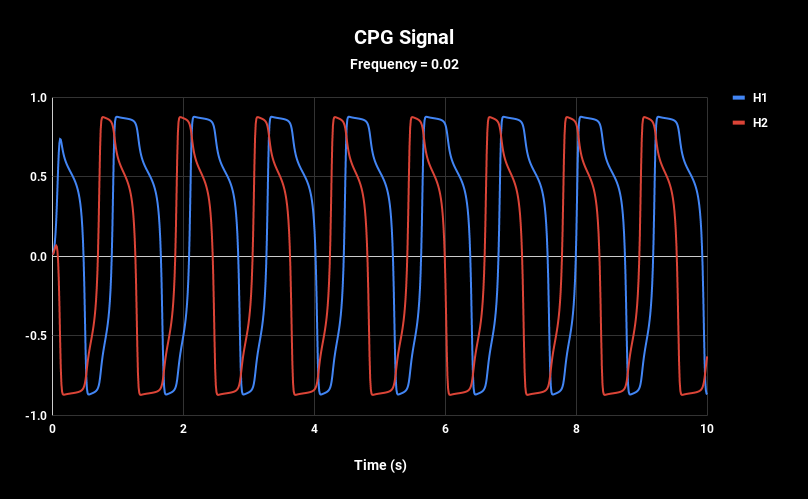
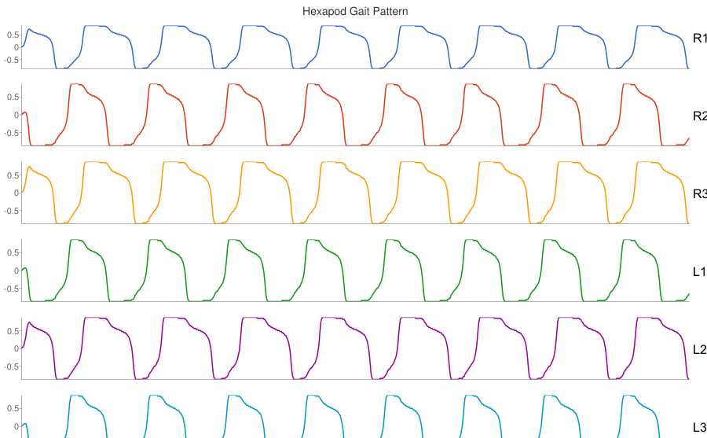
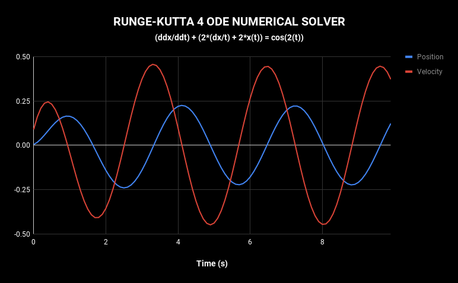

# Exercises from Lecture in Dynamic Computation and Muscle Model

Python scripts provided in class moved to C++. Figures done with Google Sheets.

## SO2 hexapod CPG

Basic SO2 CPG implementation for the tripod gait of an insect.

 - SO2 CPG Signal:

 - Hexapod tripod gait pattern:

## Runge-Kutta 4 numerical method to solve ODEs

Numerical method to approximate the solution of Ordinary Differential Equations.

