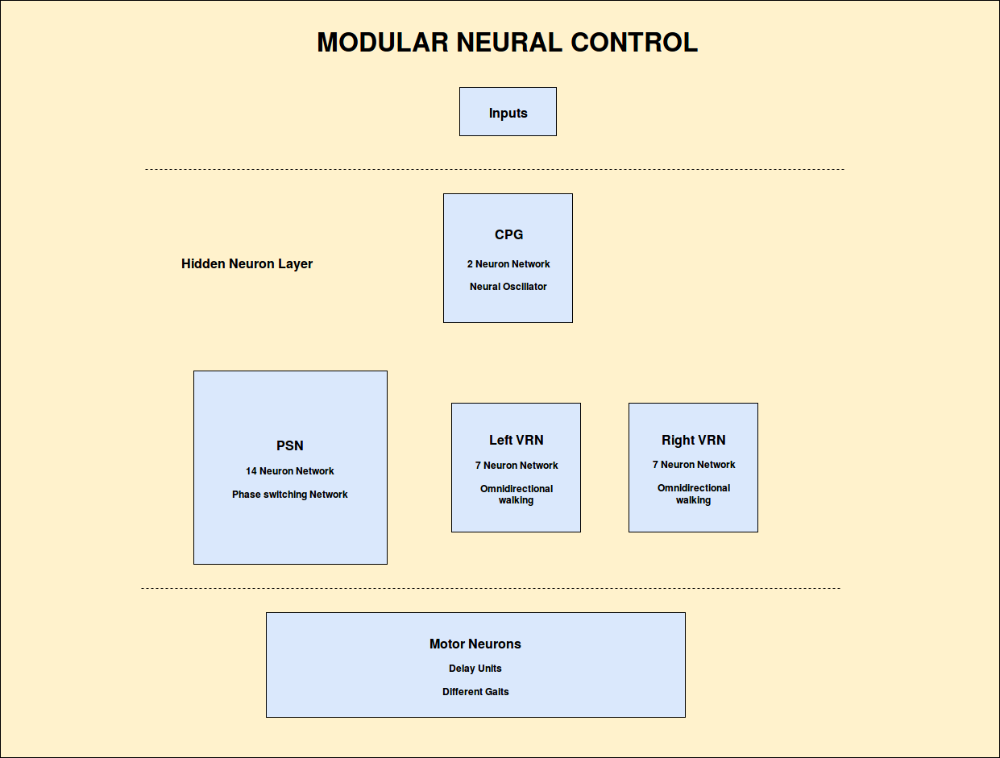
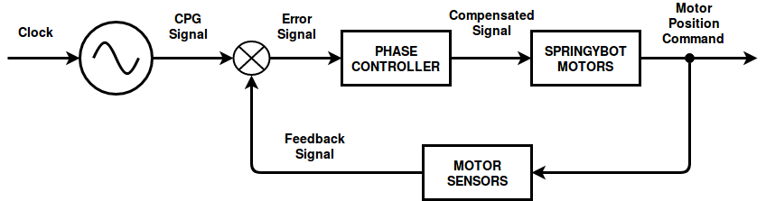

# AI3 Final Project

This project belongs to the course of **Adaptive Embodied Locomotion Control Systems**, which is part of the 3rd semester of MSc in Robot Systems at University of Southern Denmark.

For a more detailed report on the project, go to the repo's [Wiki](https://github.com/CVH95/Shangai/wiki).

## 1. Project Description.

### 1.1. Contents.

The repo contains several directories and files:
 
 - **controller:** Implementation of the controller for the real LocoKit robot in C++. Uses the LocoKitInterface API for C++.
 - **Neuron:** C++ implementation of a class to define neurons as objects.
 - **PSN:** C++ implementation of a class to define Phase Switching Netwoks (L9 - Modular Neural Control).
 - **RK4:** C++ implementation of a class with mathematical methods to solve ODEs numerically with the Runge-Kutta approximation (L8 - Dynamic Computation and Muscle Model).
 - **simulation:** Interface for simulation of the LocoKit robot controller using LPZROBOTS C++ framework. 
 - **SO2:** C++ implementation of a class that defines an SO2 Central Pattern Generator network (L8 - Dynamic Computation and Muscle Model).
 - **TransferFuntion:** C++ implementation of a class with mathematical transfer functions commonly used in artificial neurons.
 - **VRN:** C++ implementation of a class to decine Velocity Reduction Networks (L9 - Modular Neural Control). 
 - **tests:** Contains tests for the above projects.

### 1.2. Modular Neural Control

Bio-inspired locomotion control design. MNC corresponds to the CPG-based open-loop control, which retrieves omnidirectional walking with multiple gaits (leg motion pattern). Basic schema of a modular controller:

The modular controller has 5 controlling inputs. Basic robot commands in terms of the inputs:

|Action    |i1    |i2    |i3    |i4    |i5    |
|----------|:----:|:----:|:----:|:----:|:----:|
|Forward   |0     |1     |0     |-1    |-1    |
|Backwards |0     |1     |0     |1     |1     |
|Turn right|0     |1     |0     |-1    |1     |
|Turn left |0     |1     |0     |1     |-1    |

## 2. Robot Assembly Design.

## 3. Controller Design and Diagram.

### 3.1. Phase controller (lower-level actuator controller)

The different gaits are obtained by varying the **phase** between the legs, thus alternating the stance and swing phases between them. Therefore, it is of extreme importance to control the phase in each leg and keep it constant while executing a certain gait. The figure below shows the main phase control loop for each leg. The controller acts in a way such that it checks the difference phase between the CPG signal and the actual position reached by the motor. Up to a threshold error value, it compensates the error by adding/substracting. If the error is too big, then the controller stops the robot motion and sets all motors to home position, so that it can start walking again.

### 3.2. Modular controller (higher-level controller)

"Behavior control." Changes in gait, direction... provides learning and adaptation to new surfaces, inclination... 

## 4. Implementation.

## 5. Usage.

## 6. Results and Conclusions.

## Authors

Carlos Viescas Huerta.

cavie17@student.sdu.dk

## References

 - [LocoKit](https://locokit.sdu.dk/) robot.
 - LocoKit [C API](https://locokit.sdu.dk/static/doxydir/html/locoapi_8h.html).
 - LocoKit [Python API](https://locokit.sdu.dk/static/Python/locox.html).
 - LPZROBOTS [C++ framework](http://robot.informatik.uni-leipzig.de/software/).
 - LPZROBOTS [git repository](https://github.com/pmanoonpong/lpzrobots).
 - Gorobots-edu [git repository](https://github.com/pmanoonpong/gorobots_edu).